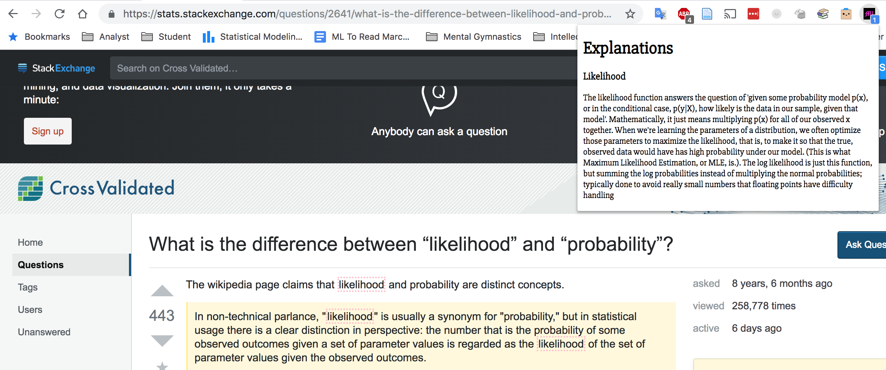
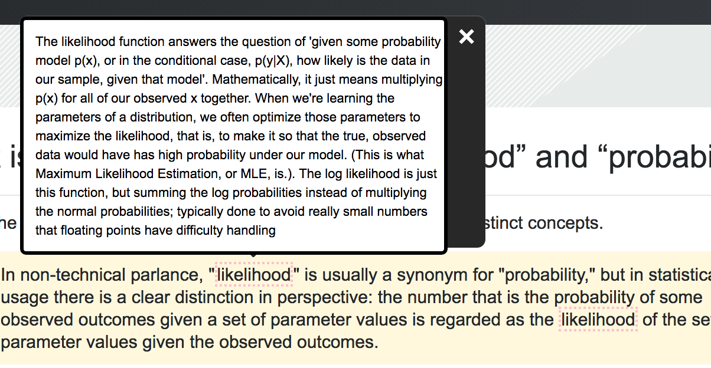

## This is a small Chrome extension designed to: 
1) Take as input two lightweight JSON files containing short explanations of terms,
2) Search for those terms appearing in web pages, and 
3) When those terms are found, surface those explanations, either in the form of hover-tooltips, or in the chrome popup window

